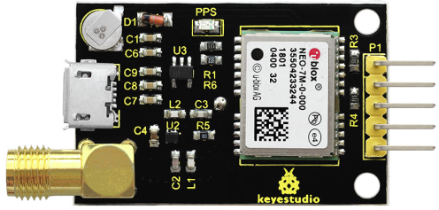
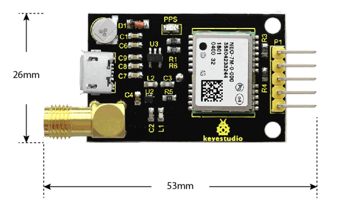
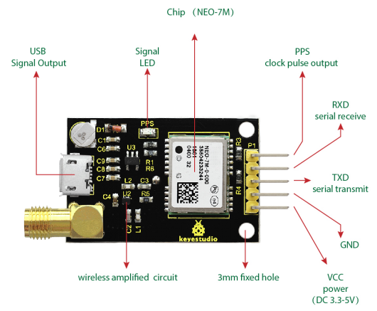
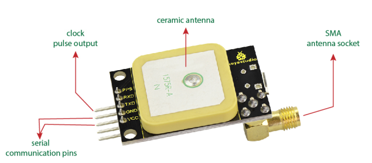
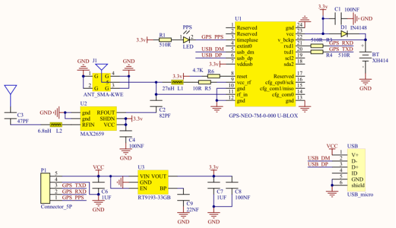
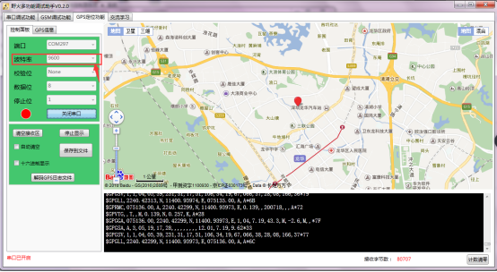

# KS0319 keyestudio GPS Module

## 1. Overview

This GPS module is based on the NEO-7M, can be used for satellite positioning.

The module supports NMEA standard protocol output, built-in FLASH, and can save the setting information after power-off without external EEPROM.

This module has an on-board ceramic antenna, which can easily locate the satellite in an open place without an external antenna. It also welded with an SMA head, which can be used for an external antenna, to make the search positioning ability more stronger.

When using, you can debug the GPS module using the data cable via the micro usb interface. Or through the reserved serial port interface, use USB to serial port modules or external MCU to receive the GPS information.

**Pay special attention to:**

If connect the external antenna, the C2 capacitor on the module needs to be removed. The internal antenna and external antenna are used together to cause collision and influence positioning.

Because there is no satellite signal inside the room, the module can only be used outdoors, so cannot be used for positioning indoors. The module has a positioning accuracy of up to 2.5 meters.

## 2. Features

- On-board with ceramic antenna, which can easily locate the satellite in an open place without an external antenna.
- Welded with an SMA head, used for an external antennato make the positioning ability stronger.
- Comes with micro usb interface, for debugging the GPS module via data cable.
- Reserved serial port interface, used for USB to serial port modules or external MCU to receive the GPS information.
- Comes with a signal indicator, indicating whether the GPS receive the information or not.

## 3. Dimensions

## 4. Element and Interface Introduction

Below is an explanation of what every element and pin of the board does.

| No.  | Pins    | Explanation                                                  |
| ---- | ------- | ------------------------------------------------------------ |
| 1    | **VCC** | Power（DC 3.3-5V）                                           |
| 2    | **GND** | Ground                                                       |
| 3    | **TXD** | **Serial transmit:** connected to the RXD of microcontroller and USB to serial module. |
| 4    | **RXD** | **Serial receive:** connected to the TXD of microcontroller and USB to serial module. |
| 5    | **PPS** | Clock pulse output pin (GPS second pulse signal, 1 piece per second, used to indicate the time of the whole second. The accuracy is up to nanoseconds, and there is no cumulative error.) |

## 5. Technical Parameters

- Operating Voltage: DC 3.3-5V
- Current: 40mA
- Default buad rate: 9600 ( modified through U-CENTER)
- Output frequency: 1Hz ( modified through U-CENTER)

## 6. Schematic Diagram

## 7. Example Use

**Step1:** Connect the FT232 module to the computer, and install well the driver. Then for **computer properties - Device Manager**, find the corresponding COM port (COM297).

**Step2:** Connect the GPS module to FT232 module.

| GPS module | FT232 module |
| ---------- | ------------ |
| VCC        | VCC          |
| GND        | GND          |
| TXD        | RXD          |
| RXD        | TXD          |

**Step3:** Use the functional debug assistant to debug it, for GPS positioning function, set the COM port and baud rate (default 9600). Open the serial port, wait for a moment, it will show your positioning.

Note that the GPS module can only for outdoors use, cannot positioning indoors. 

